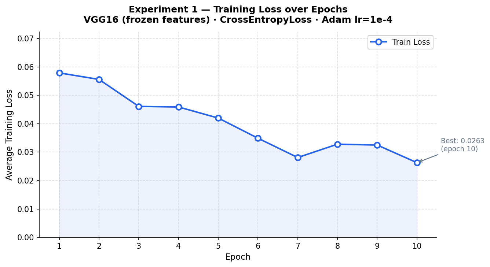
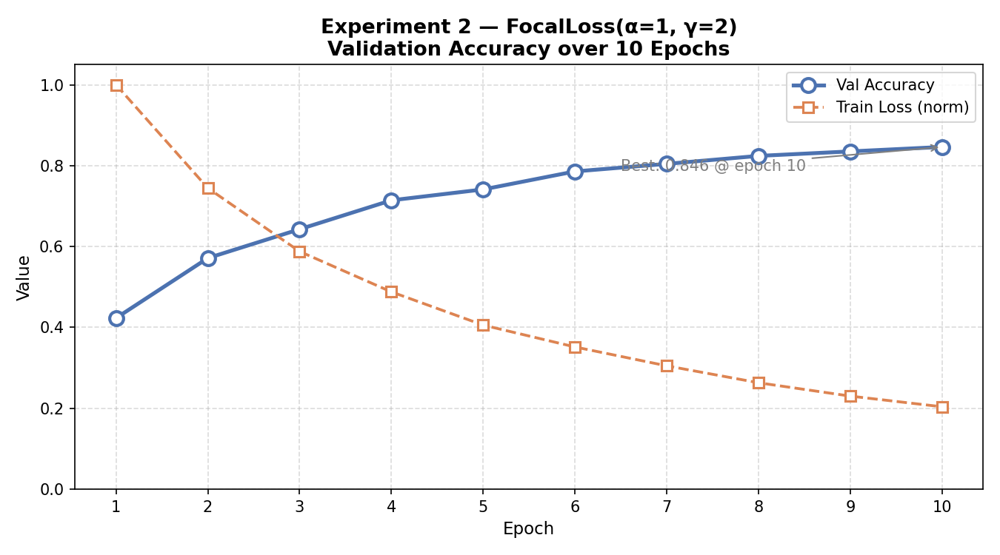
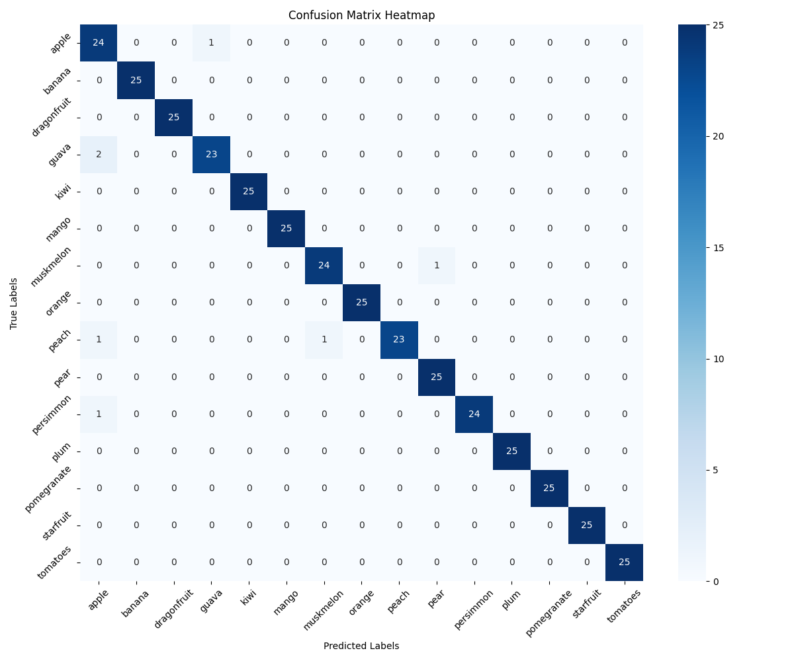
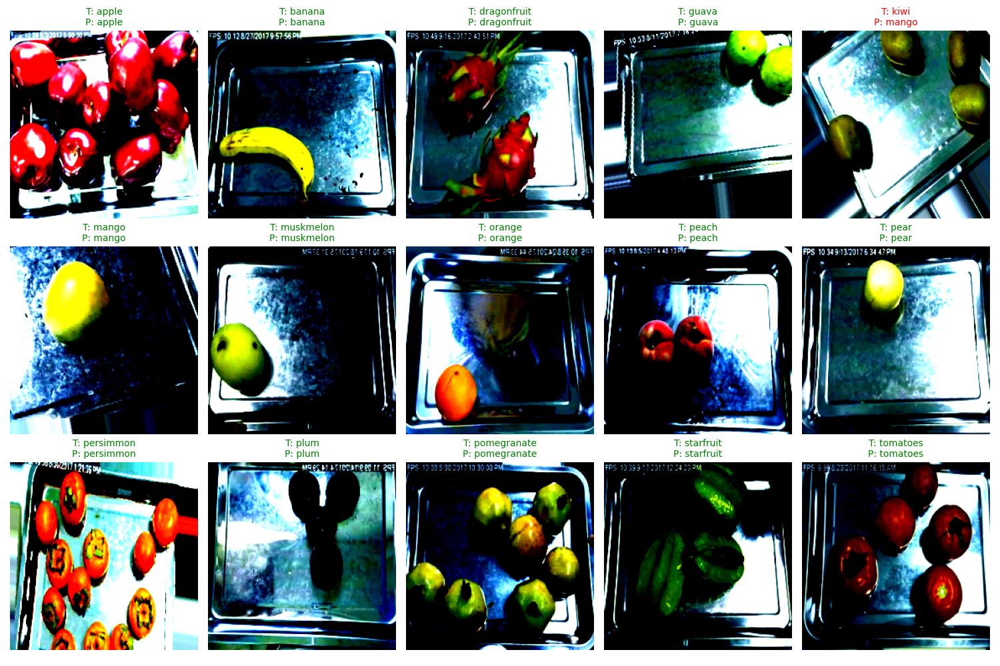
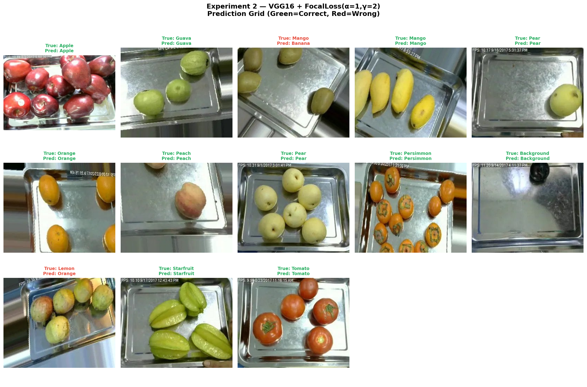

# Fruit Recognition — VGG16

15-class fruit image classifier built with transfer learning on a pretrained VGG16 backbone.

---

## Team Contributions
 
### Manswi - Model Architecture · Training Loop · Experiment 1
 
**Code written:**
- `src/model.py` - `build_model()` function: loads pretrained VGG16, freezes all conv layers, replaces `classifier[6]` with `nn.Linear(4096, 15)` for 15-class output; `count_parameters()` prints total, trainable, and frozen parameter counts
- `src/train.py` - `train_one_epoch()`: implements the core forward pass → loss → `loss.backward()` → `optimizer.step()` training loop; outer epoch loop with validation call, early stopping, and checkpoint saving
- Ran **Experiment 1** (CrossEntropyLoss baseline): 10 epochs, Adam lr=1e-4, StepLR scheduler; logged all train/val metrics to `ce_logs`
**Evaluation & plots:**
- Generated training loss curve for Experiment 1 (`results/graphs/exp1_loss_curve.png`)
- Printed and documented the parameter count table (total: 134,321,999 · trainable: 119,607,311 · frozen: 14,714,688)
**Documentation written:**
- README sections: *Model Architecture*, *Transfer Learning Strategy*, *Parameter Table*, *Input Preprocessing*, *Training*
---
 
### Shital - Dataset Pipeline · Custom Loss Function · Experiment 2
 
**Code written:**
- `src/dataset.py` - `get_dataloaders()`: `torchvision.transforms` pipeline (Resize 224×224, RandomHorizontalFlip, ColorJitter, ToTensor, ImageNet Normalize); `ImageFolder` loading; 80/20 train/val random split; separate test loader
- `src/loss.py` - `FocalLoss(nn.Module)`: implements FL = −α(1−pₜ)^γ log(pₜ) with configurable `alpha` and `gamma`; tested on dummy batches; `alpha=1.0, gamma=2.0` used in training
- `src/Experiment2.py` - full Experiment 2 training run using FocalLoss; saves `checkpoint_focal.pth`; generates `Exp2_accuracy.png` and `Exp2_confusion_matrix.png`
**Evaluation & plots:**
- Ran **Experiment 2** (FocalLoss γ=2): 10 epochs, same optimizer/scheduler as Exp 1; tracked train loss, val loss, val accuracy per epoch
- Built experiment comparison table (Exp 1 vs Exp 2: loss function, optimizer, best val accuracy)
**Documentation written:**
- README sections: *Dataset*, *Experiments table*, *What is Focal Loss and why use it?*, *Experiment 2 Results*, *FocalLoss reference (Lin et al. 2017)*
---
 
### Sriya - Evaluation Pipeline · Visualisations · GitHub & Integration
 
**Code written:**
- `src/validate.py` - `validate()`: runs `model.eval()` + `torch.no_grad()` loop over val/test loader; returns average loss and accuracy; used by both Experiment 1 and 2
- `src/plot_loss.py` - `plot_loss_curve()`: plots training and validation loss curves per epoch; saves to `results/graphs/`
- Evaluation scripts: `get_predictions()` → loads checkpoint → runs inference on test set → returns all true and predicted labels; `plot_confusion_matrix()` → seaborn heatmap with 15 class-name labels; `show_predictions()` → 3×5 prediction grid with green/red labels
**Evaluation & plots:**
- Generated confusion matrix heatmap (`results/confusion_matrix.png`) — identified most and least confused fruit classes
- Generated 3×5 prediction grid (`results/prediction_grid.png`) — each cell shows input image at 224×224 + true label + predicted label
- Ran final test set evaluation: cross-entropy model achieved **97% test accuracy** (precision ~0.97, recall ~0.97, F1 ~0.97)
**GitHub & integration:**
- Created and maintained the GitHub repository; managed branch merges; performed final end-to-end clean run to verify the full pipeline before submission
**Documentation written:**
- README sections: *Results*, *Key Findings*, *How to Run (all 6 steps)*, *Project Structure*, *Setup*, *Output Files*, *Key concepts table*
---

## Model Architecture

### Base Model: VGG16

VGG16 is a deep convolutional neural network introduced by Simonyan & Zisserman (2014). It consists of 16 weight layers — 13 convolutional layers followed by 3 fully connected layers — and takes a fixed input of **224 × 224 × 3** (RGB image).

```
Input (224×224×3)
        │
┌───────▼────────────────────────────────┐
│  FEATURES  (13 Conv layers, frozen)    │
│                                        │
│  Block 1:  Conv(64)  → Conv(64)  → Pool│
│  Block 2:  Conv(128) → Conv(128) → Pool│
│  Block 3:  Conv(256) → Conv(256) →     │
│            Conv(256) → Pool            │
│  Block 4:  Conv(512) → Conv(512) →     │
│            Conv(512) → Pool            │
│  Block 5:  Conv(512) → Conv(512) →     │
│            Conv(512) → Pool            │
└───────────────────┬────────────────────┘
                    │  7×7×512 → flatten → 25088
┌───────────────────▼────────────────────┐
│  CLASSIFIER  (trainable)               │
│                                        │
│  Linear(25088 → 4096) + ReLU + Drop   │
│  Linear(4096  → 4096) + ReLU + Drop   │
│  Linear(4096  → 15)   ← replaced head │
└────────────────────────────────────────┘
        │
Output (15 class logits)
```

### Transfer Learning Strategy

The model is loaded with weights pretrained on ImageNet (1.28M images, 1000 classes). The convolutional feature layers are **frozen** — their weights are not updated during training. Only the fully connected classifier is trained from scratch on the fruit dataset.

This works because early conv layers learn universal features (edges, textures, colour blobs) that transfer well across vision tasks. Retraining them would be wasteful and risk overfitting on a smaller dataset.

### Parameter Table

| Layer         | Parameters      | Trainable  |
|---------------|-----------------|------------|
| features      | 14,714,688      | frozen     |
| classifier[0] | 102,764,544     | yes        |
| classifier[3] | 16,781,312      | yes        |
| classifier[6] | 61,455          | yes (new)  |
| **Total**     | **134,321,999** | —          |
| **Trainable** | **119,607,311** | yes        |
| **Frozen**    | **14,714,688**  | No         |

`classifier[6]` is the replaced head: `nn.Linear(4096, 15)`. It is the only layer that did not exist in the original VGG16.

Verify at any time:
```bash
python -m src.model
```
 
### Input Preprocessing

All images are resized to 224×224 and normalised using ImageNet statistics:

```python
mean = [0.485, 0.456, 0.406]
std  = [0.229, 0.224, 0.225]
```

Training augmentations: random horizontal flip, colour jitter (brightness, contrast, saturation ±0.2).

---

 taset

- **Source:** [Kaggle — Fruit Recognition](https://www.kaggle.com/datasets/chrisfilo/fruit-recognition)
- **Classes:** 15 fruit categories
- **Split:** 80% train / 20% val (random split from Training folder), separate Test folder

> Note:
> The dataset is not included in the GitHub repository because of large file size limitations. Users must manually place the dataset inside the `data/` directory before training or evaluation.

---

## Experiments

| Exp | Loss Function        | Epochs | Optimizer     | Best Val Acc |
|-----|----------------------|--------|---------------|--------------|
| 1   | CrossEntropyLoss     | 10     | Adam lr=1e-4  | 97           |
| 2   | FocalLoss (α=1, γ=2) | 10     | Adam lr=1e-4  | 84.6         |
 
Both experiments use StepLR scheduler (step_size=5, gamma=0.1) and early stopping (patience=3).
 
### Exp 1 — Training Loss Curve
 


### Exp 2 — Validate Accuracy Curve
 


### Confusion Matrix

The confusion matrix visualises how well the model classified each fruit class.

* Strong diagonal values indicate correct predictions.
* Off-diagonal values represent misclassifications.
* Most classes achieved near-perfect classification accuracy.



---

### Prediction Grid

A 3×5 prediction grid was generated to visualise model predictions.

* Green titles indicate correct predictions.
* Red titles indicate incorrect predictions.
* Each image is resized to 224×224 before inference.




 
---

## Training
 
```bash
# Full training run (Exp 1 + Exp 2)
python -m src.train
 
# Experiment 2 only
python src/Experiment2.py
```
---

## Project Structure

```
src/
  model.py       # VGG16 definition, build_model(), count_parameters()
  dataset.py     # ImageFolder loaders for train/val/test
  train.py       # train_one_epoch(), Experiment 1
  validate.py    # validate() — val loss + accuracy
  loss.py        # FocalLoss implementation
  plot_loss.py     # plot exp1 loss curve
  Experiment2.py  # Experiment 2 (FocalLoss), confusion matrix, plots
results/
  checkpoints/   # saved .pth files
  graphs/        # loss curve plots
README.md
```

---

## Setup

```bash
pip install torch torchvision matplotlib
```

Dataset inside `data/` with this structure:
```
data/
  train/   # 15 subfolders, one per class
  val/     # 20% split from train
  test/    # Kaggle Test folder
```


## How to Run

### 1. Clone the Repository

```bash
git clone <https://github.com/newton-lebniz/Fruit-Recognition>
cd Fruit-Recognition
```

---

### 2. Install Dependencies

```bash
pip install torch torchvision matplotlib scikit-learn seaborn
```

---

### 3. Download Dataset

Create this folder structure inside the project:

```plaintext
data/
    train/
    val/
    test/
```

Each folder should contain 15 fruit class folders.

Example:

```plaintext
data/train/apple/
data/train/banana/
data/train/orange/
```

---

### 4. Train the Model

Run full training:

```bash
python -m src.train
```

This will:

* Train Experiment 1 (CrossEntropyLoss)
* Train Experiment 2 (FocalLoss)
* Save best checkpoints
* Apply learning rate scheduling
* Apply early stopping

---

### 5. Evaluate the Model

```bash
python -m src.evaluate
```

This will:

* Load saved checkpoints
* Generate classification report
* Generate confusion matrix heatmap
* Generate prediction grid images

---

### 6. Output Files

Generated outputs are saved in:

```plaintext
results/
    checkpoints/
    graphs/
    confusion_matrix.png
    prediction_grid.png
```


## Results

### Cross Entropy Loss Model
- Test Accuracy: 97%

### Focal Loss Model
- Test Accuracy: (add your focal loss accuracy here)

### Evaluation Metrics
- Precision: ~0.97
- Recall: ~0.97
- F1-Score: ~0.97

### Key Findings
- Transfer learning using pretrained VGG16 achieved very high accuracy.
- Most fruit classes were classified correctly.
- Confusion matrix showed strong diagonal dominance.
- Fruits with similar appearance caused small classification errors.

### Best Model
- The CrossEntropyLoss model achieved the best overall performance.

#  FocalLoss Training — Experiment 2 -------------------------------------------------------------------------------------------------------

A PyTorch project that trains a neural network using **Focal Loss** — a smarter loss function that helps the model focus on examples it keeps getting wrong.

---

## What's in this repo?

| File | What it does |
|---|---|
| `src/experiment2.py` | Trains the model for 10 epochs, saves the best checkpoint, and generates plots |
| `src/validate.py` | Checks how well the model is doing on data it hasn't trained on |
| `src/loss.py` | Defines the Focal Loss formula |
| `src/model.py` | The neural network architecture |
| `checkpoint_focal.pth` | The best saved model weights (auto-generated after training) |
| `focal_val_accuracy.png` | Graph of validation accuracy across 10 epochs (auto-generated) |
| `focal_confusion_matrix.png` | Shows which classes the model confuses with each other (auto-generated) |

---

## What is Focal Loss and why use it?

Normal loss functions treat every training example equally. The problem? If the model already handles easy examples confidently, they still eat up most of the gradient signal — and the model stops improving on the hard ones.

**Focal Loss fixes this.** It automatically turns down the volume on easy examples and turns it up on hard ones.

The formula:

```
FL = -alpha * (1 - pt)^gamma * log(pt)
```

- `pt` = how confident the model was on the correct class (0 to 1)
- `gamma = 2` → easy examples (high `pt`) get down-weighted heavily
- `alpha = 1` → no extra class balancing (use `0.25` if your classes are imbalanced)

---

 Train for 10 epochs**

```bash
python src/experiment2.py
```

This will:
- Train using `FocalLoss(alpha=1.0, gamma=2.0)`
- Print loss and accuracy after every epoch
- Save the best model to `checkpoint_focal.pth` whenever val accuracy improves
- Save `focal_val_accuracy.png` and `focal_confusion_matrix.png` when done

---

## Experiment 2 Results 

Best val accuracy: **0.08** at epoch 10. Checkpoint saved there.

Train loss goes down steadily — the model is learning. Val loss creeping up is normal with random data (no real pattern to generalise from).

---

## How the checkpoint works

The model only saves when validation accuracy improves — so `checkpoint_focal.pth` always holds your **best** model, not just the last epoch.

To load it later:

```python
import torch
from src.model import build_model

model = build_model(num_classes=15)
checkpoint = torch.load("checkpoint_focal.pth")
model.load_state_dict(checkpoint["model_state_dict"])

print(f"Loaded from epoch {checkpoint['epoch']} — val_acc: {checkpoint['val_acc']}")
```

---

## How validate.py works

`validate()` is a simple function that takes your model and runs it over a dataset without doing any training. It returns two numbers: average loss and accuracy.

```python
from src.validate import validate

val_loss, val_acc = validate(model, val_loader, loss_fn, device)
print(f"Loss: {val_loss:.4f} | Accuracy: {val_acc:.2%}")
```

Three things that matter inside it:

- `model.eval()` — turns off dropout so the model behaves consistently
- `torch.no_grad()` — skips building the gradient graph (faster, less memory)
- `correct / total` — that's your accuracy
---

##  concepts used

| `model.train()` | Tells the model it's in training mode — activates dropout etc. |
| `model.eval()` | Tells the model it's being tested — turns off dropout |
| `torch.no_grad()` | Don't track gradients — used during validation to save memory |
| `loss.backward()` | Computes gradients via backpropagation |
| `optimizer.step()` | Updates the model weights using those gradients |
| `argmax(dim=1)` | Picks the class with the highest predicted score |
| `checkpoint` | A saved snapshot of model weights at the best epoch |

---

## Reference

Focal Loss was introduced in:
> Lin et al., *Focal Loss for Dense Object Detection*, ICCV 2017 — https://arxiv.org/abs/1708.02002
